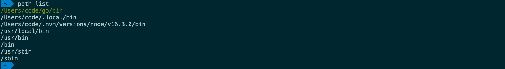

[](https://github.com/sha1n/path-ethic/actions/workflows/ci.yml)

- [PATH Ethic](#path-ethic)
  - [Main Features](#main-features)
  - [Limitations](#limitations)
  - [Alternatives](#alternatives)
- [Features](#features)
  - [Path Editing Commands](#path-editing-commands)
    - [show](#show)
    - [list](#list)
    - [push](#push)
    - [append](#append)
    - [flip](#flip)
    - [rm](#rm)
    - [reset](#reset)
  - [Preset Management Commands](#preset-management-commands)
    - [save](#save)
    - [load](#load)
    - [listp](#listp)
    - [rmp](#rmp)
  - [Other Commands](#other-commands)
    - [update](#update)
    - [help](#help)
  - [Automatic Preset Loading with `.pethrc`](#automatic-preset-loading-with-pethrc)
  - [Zsh Completion](#zsh-completion)
- [How to Install](#how-to-install)
- [How to Uninstall](#how-to-uninstall)
- [Migrating Persistent Data](#migrating-persistent-data)


# PATH Ethic
`path-ethic` is a native [oh-my-zsh](https://github.com/ohmyzsh/ohmyzsh) plugin that provides CLI for `PATH` manipulation, `PATH` preset management and automatic per-directory preset loading. It does not touch your existing `.zshrc`, `.zprofile` or any other shell environment configuration, but adds on top of existing environment.


## Main Features
- quick and easy CLI based `PATH` management
- named `PATH` presets
- switch between two binary versions quickly
- scripting friendly

## Limitations
- no persistent `PATH` overrides
- designed to work with Zsh only

## Alternatives
If you are looking for a more comprehensive and advanced shell environment configuration management tool, or something that supports more shells, check out [direnv](https://github.com/direnv/direnv).

# Features
## Path Editing Commands
### show
`peth [show]` - displays the current value of `PATH` and the values of any set prefix and suffix.


### list
`peth list` - similar to `show` but lists elements in separate lines.



### push
`peth push <path>` - adds a new element at the beginning of the `PATH` and re-exports.

### append
`peth append <path>` - adds a new element at the end of the `PATH` and re-exports.
 
### flip
`peth flip` - flips the prefix and suffix to reverse their priority. This is a very handy feature if often need to switch between different verisons of the same software.

<details>
  <summary>Demo</summary>
  
</details>

### rm
`peth rm <path>` - removes a path element from the `PATH` and re-exports. If the removed element is a part of the normal user `PATH`, it is removed only in the current session even if the changes are committed. If you want to edit the `PATH` variable, use the plugin and when you're happy copy the effective path value from the output of `peth show` and export it from your `.zshrc` or wherever you manage exports.

### reset
`peth reset` - removes all prefixes and suffixes and re-exports the original `PATH`.

## Preset Management Commands
### save
`peth save [name]` - saves the current session settings to disk for later recall. If the optional name argument is provided, settings are saved as a preset under that name.

- Data is saved to `~/.path-ethic` 
- User home paths are substituted with `$HOME` for better portability

### load
`peth load [name]` - loads previously saved settings into the current session. If the optional name argument is provided, attempts to load a named preset.

### listp
`peth listp` - lists all saved presets

### rmp
`peth rmp <name>` - removes a previously saved preset

## Other Commands
### update
`peth update` - if cloned from a remote git repository, prompts to pull the latest changes from that remote.

### help
`peth help` - displays help.

## Automatic Preset Loading with `.pethrc`
When you change directory the plugin looks for a file named `.pethrc` in the target directory. If one is found, it tries to read a preset name from it and load it into the current session. This is helpful if you need different sets of tools or verisons for different projects. To take adventage of this feature, first [save](#save) a named preset and then just create a `.pethrc` with its name in your project directory.

## Zsh Completion
The plugin comes bundled with completion functions that are automatically registered to be loaded if Zsh completion system is enabled.
If completion doesn't work for the `peth` command, consider adding the following to `.zshrc`.

```bash
# enable autocomplete functions
autoload -U compinit
compinit
```

# How to Install
1. Clone this repository to `$ZSH_CUSTOM/plugins/path-ethic`
```bash
mkdir -p "$ZSH_CUSTOM/plugins" && git clone git@github.com:sha1n/path-ethics.git "$ZSH_CUSTOM/plugins/path-ethic"
```
2. Enable the plugin by adding `path-ethic` to the plugin list `plugins=()` in `~/.zshrc` .
```bash 
plugins=(
  path-ethic      # <-- add this
)
```

# How to Uninstall
1. Reverse the [installation steps](#how-to-install).
2. You may want to delete the directory `~/.path-ethic`. This is where committed `PATH` elements and presets are saved.

# Migrating Persistent Data
In order to make committed changes more portable, right before changes are saved all user home paths are replaced with `$HOME`. 
Therefore, when you migrate settings to a new computer or user on the same computer, you can simply install the plugin, copy `~/.path-ethic` 
to your new home directory and you should be good to go.

