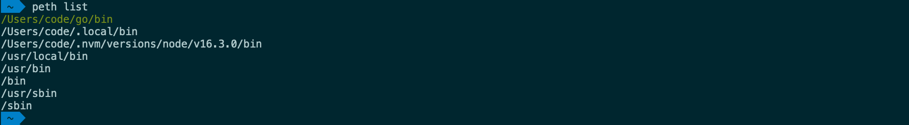
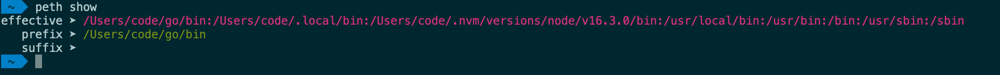

[](https://github.com/sha1n/path-ethic/actions/workflows/ci.yml)

- [path-ethic](#path-ethic)
- [CLI Commands](#cli-commands)
  - [Path Editing Commands](#path-editing-commands)
    - [peth list](#peth-list)
    - [peth show](#peth-show)
    - [peth push](#peth-push)
    - [peth append](#peth-append)
    - [peth flip](#peth-flip)
    - [peth rm](#peth-rm)
    - [peth reset](#peth-reset)
  - [Preset Management Commands](#preset-management-commands)
    - [peth save (previously 'commit')](#peth-save-previously-commit)
    - [peth load (previously 'reload')](#peth-load-previously-reload)
    - [peth listp](#peth-listp)
    - [peth rmp](#peth-rmp)
  - [Other Commands](#other-commands)
    - [peth update](#peth-update)
    - [peth help](#peth-help)
  - [How to Install](#how-to-install)
  - [How to Uninstall](#how-to-uninstall)
  - [Migrating Committed Data](#migrating-committed-data)

# path-ethic
`path-ethic` is a simple Zsh native [oh-my-zsh](https://github.com/ohmyzsh/ohmyzsh) plugin that provides a CLI for `PATH` manipulations. It won't touch your existing `.zshrc`, `.zprofile` or any other shell environment configuration, but add on top of your existing environment.


**Main Features**
- quick and easy CLI based `PATH` management
- named `PATH` presets
- switch between two binary versions quickly
- scripting friendly


# CLI Commands
## Path Editing Commands 
### peth list
`peth list` - similar to `show` but lists elements in separate lines.



### peth show
`peth show` - displays the current value of `PATH` and the values of any set prefix and suffix.



### peth push
`peth push <path>` - adds a new element at the beginning of the `PATH` and re-exports.

### peth append
`peth append <path>` - adds a new element at the end of the `PATH` and re-exports.
 
### peth flip
`peth flip` - flips the prefix and suffix to reverse their priority. This is a very handy feature if often need to switch between different verisons of the same software.

<details>
  <summary>Demo</summary>
  
</details>

### peth rm
`peth rm <path>` - removes a path element from the `PATH` and re-exports. If the removed element is a part of the normal user `PATH`, it is removed only in the current session even if the changes are committed. If you want to edit the `PATH` variable, use the plugin and when you're happy copy the effective path value from the output of `peth show` and export it from your `.zshrc` or wherever you manage exports.

### peth reset
`peth reset` - removes all prefixes and suffixes and re-exports the original `PATH`.

## Preset Management Commands 
### peth save (previously 'commit')
`peth save [save]` - saves the current session settings to disk for later recall. If the optional name argument is provided, settings are saved as a preset under that name.

- Data is saved to `~/.path-ethic` 
- User home paths are substituted with `$HOME` for better portability

### peth load (previously 'reload')
`peth load [name]` - loads previously saved settings into the current session. If the optional name argument is provided, attempts to load a named preset.

### peth listp
`peth listp` - lists all saved presets

### peth rmp
`peth rmp <name>` - removes a previously saved preset

## Other Commands
### peth update
`peth update` - if cloned from a remote git repository, prompts to pull the latest changes from that remote.

### peth help
`peth help` - displays help.


## How to Install
1. Clone this repository to `$ZSH_CUSTOM/plugins/path-ethic`
```bash
mkdir -p "$ZSH_CUSTOM" && git clone git@github.com:sha1n/path-ethics.git "$ZSH_CUSTOM/plugins/path-ethic"
```
2. Enable the plugin by adding `path-ethic` to the plugin list `plugins=()` in `~/.zshrc` .
```bash 
plugins=(
  path-ethic      # <-- add this
)
```

## How to Uninstall
1. Reverse the [installation steps](#how-to-install).
2. You may want to delete the directory `~/.path-ethic`. This is where committed `PATH` elements and presets are saved.


## Migrating Committed Data
In order to make committed changes more portable, right before changes are saved all user home paths are replaced with `$HOME`. 
Therefore, when you migrate settings to a new computer or user on the same computer, you can simply install the plugin, copy `~/.path-ethic` 
to your new home directory and you should be good to go.

